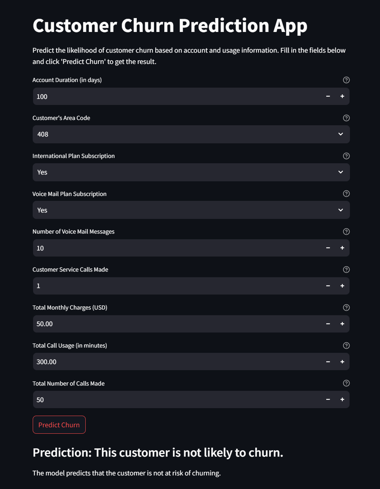

# Customer Churn Prediction App

This repository contains a Streamlit web application for predicting customer churn in the telecommunications industry. The app uses a trained machine learning model to predict the likelihood of a customer churning based on their account and usage information.

## How to Use the App

This app is designed for easy deployment and usage. Follow the steps below to run it:

### 1. Clone the Repository:
```bash
git clone https://github.com/12sudeep/telecom-churn-analysis-and-prediction.git
```

### 2. Navigate to the App Directory:
```bash
cd telecom-churn-analysis-and-prediction/code  
```

### 3. Install Required Libraries:
```bash
cd telecom-churn-analysis-and-prediction/code  
```

### 4. Run the Streamlit App:
```bash
cd telecom-churn-analysis-and-prediction/code  
```

This will open the app in your default web browser.

### 5. Using the App Interface
Once the app is running, you'll see an interactive interface. You can input customer information into the provided fields, such as account length, total charges, customer service calls, etc. Click "Predict Churn" to get a prediction.


# Model Details

The app uses a **Random Forest** model trained on a dataset of telecom customer data. The model was trained using key libraries like scikit-learn. The training code and data preprocessing steps are available in the `telecom-churn-analysis-and-prediction.ipynb` file. The model achieved an accuracy of **93%** and an F1-score of **0.93**.

## Key Features

- **Interactive Interface**: Easily input customer data and get real-time churn predictions.
- **Random Forest Model**: Utilizes a **Random Forest** model, known for its high accuracy and ability to handle non-linear relationships.
- **Easy Deployment**: Simple setup and deployment using Streamlit.

## Screenshots



## Future Enhancements

- Integrating more features
- Using a different model
- Adding more visualizations

## Contributing

Contributions are welcome! Please feel free to open issues or submit pull requests.

